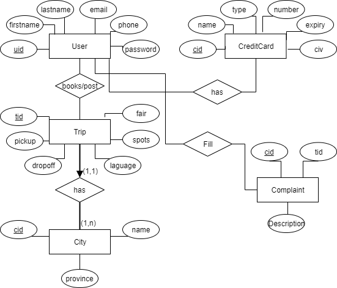

# Build Status

# License

# Team (Contributors)
| Name                   | Email               |Role                 |
|------------------------|---------------------|---------------------|
| Brahim Kanouche        | bkano020@uottawa.ca |Front End Lead       |
| Emmanuel Asinyo        | wkenn072@uottawa.ca |Porject Manager      |
| Jack Wu                | cwu087@uottawa.ca   |Back End Lead        |
| Simon Fu               | sfu013@uottawa.ca   |Architect & QA       |

# Project - FunRide -
FunRide is a project of Simon Fu, Jack Wu, Emmanuel Asinyo, and Brahim Kanouche for the SEG4910/4911 Capstone software engineering project course at the University of Ottawa. This project is under the supervision of Miguel Garzon and is presented to our client Dr.Stephane Some. FunRide is an 8-month project following the agile methodology where both the front-end and back-end will be built from scratch.

FunRide is a mobile application that will be available in the Google Play that will serve as a rideshare platform for traveling between cities in Canada. Ridesharing is a more economical option to travel from Point A to Point B in comparison to trains, busses, or flying. As a result, many people especially students are looking for advertisements in platforms like Kijiji or Craigslist to find these services.

The concern with using these applications is that it is not reliable for neither the driver nor passenger; safety is a problem as well. For example, there is nothing stopping drivers from going back on their word on what they posted in their advertisement, and there are no consequences to stop passengers from not showing up to a pickup location.

We created FunRide as a way for passengers to reserve rideshares without having to worry about these issues. Our goal is to provide a platform that emphasizes reliability, safety, and security.

For more information, take a look at the list of sections on our wiki https://github.com/kanouche/CapstoneBackEnd/wiki.

## Features
* Browse for rides for a specific trip. 
* Book your ride and secure your spot.
* Post your trip and get people to book available seats in your trip.
* Win-Win financially, environmentally and socially.

## FrontEnd Development Environment Setup Guide
For the back-end setup, please visit: https://github.com/kanouche/CapstoneBackEnd/blob/master/README.md

Please follow those instruction fto set up your local work environment for the front-end. 

1. Download Android studio: https://developer.android.com/studio 
2. Clone the repo using HTTPS or SSH: `$ git clone https://github.com/kanouche/CapstoneFrontEnd.git`
3. Open the project on Android studio and you are good to go. 

Learn more about Android studio and Android developement: https://developer.android.com/guide

## Database Schema
Note: 
* Since we are based on an Agile methodology, we might be doing changes regarding our Database Schedma.

